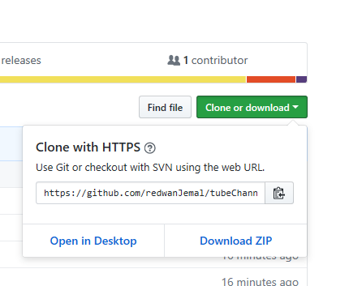

# TubeChannel
Pure React App which enables you to use as a website for your youtube channels
[]

## Fork this repository

Fork this repository by clicking on the fork button on the top of this page.
This will create a copy of this repository in your account.

## Clone the repository



Now clone the forked repository to your machine. Go to your GitHub account, open the forked repository, click on the clone button and then click the *copy to clipboard* icon.

Open a terminal and run the following git command:

```
git clone "url you just copied"
```
where "url you just copied" (without the quote marks) is the url to this repository (your fork of this project). See the previous steps to obtain the url.


For example:
```
git clone https://github.com/redwanJemal/tubeChannel.git
```

## Open Your Folder and install dependencies
```
npm install

Get Youtube Api from Google Developer console
```

## Projects in Image


## Technologies Used
```
React
Semanti Ui React
Youtube Api
```